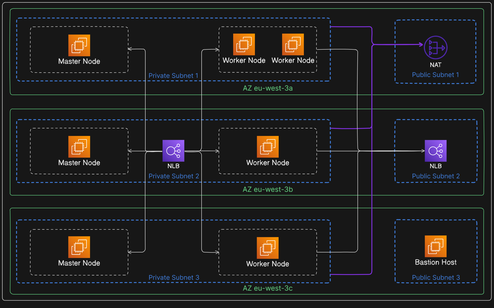
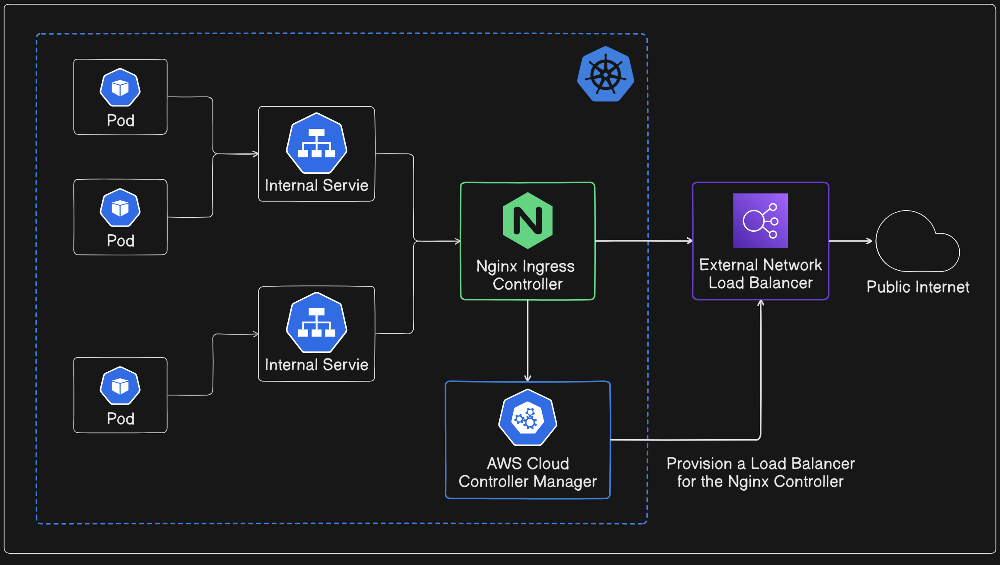

# hz-kubeadm

#### A Terraform module that deploys a Kubernetes cluster on AWS with Kubeadm.


##### This module creates:
- A `VPC` with six subnets in three Availability Zones:
    - 3 private subnets for the Kubernetes cluster.
    - 3 public subnets for external Load Balancers and other instances.
- Either a `NAT-Gateway` or a `NAT-Instance` (based on the inputs) to allow instances within the private subnets to reach the network.
- An odd number of `control planes` in the private subnets.
- An `Auto Scaling Group` for the `worker nodes`.
- An optional `Internal Load Balancer` mainly used to expose the Kubernetes API server as a single endpoint (enhances `High Availability`).
- Security Groups for Kubernetes ports, allowing seamless connection between the nodes.
- A `Bastion Host` used to securely connect and configure the cluster (allows only the user's IP through SSH).
- An SSH configuration that simplifies connection with the cluster (a config file will be created in "/home/user/.ssh"):
  ```sh
  ssh master-1
  ssh master-3
  ssh bastion
  ```
##### Policies (JSON format) and Scripts:
- The module installs the `AWS Cloud Controller Manager` in the cluster for a more reliable integration with the cloud infrastructure.
- Some policies are required as mentioned in the documentation => [Kubernetes AWS Cloud Provider](https://cloud-provider-aws.sigs.k8s.io/prerequisites/).
- The scripts are mainly used to initialize the cluster and generate the join scripts used for adding new worker or master nodes to the cluster.
- The scripts also leverage the AWS command-line tool; this is used by an instance/node to tag itself with a specific name (simplifies troubleshooting).
- The `cluster_init.sh` script will install the `Weave` cni plugin. 
- The `cluster_add_ons.sh` will install helm and use it to setup the `AWS Cloud Controller Manager` and the `Nginx Ingress Controller`. 
- `--cluster-cidr=10.32.0.0/12`: this option is used in the helm installation of the `AWS Cloud Controller Manager` wich is the default cidr block used by `Weave`.
- The `AWS Cloud Controller Manager` will automatically create a Load Balancer for the `Nginx Ingress Controller`. You can access the the services managed by the Ingress Controller through Load Balancer's DNS.



=> Note that the Load Balancer created in by the `AWS Cloud Controller Manager` is not managed by the module thus you must deleted manually if you want to destroy the cluster.

##### NAT option:
- You can choose either a NAT-Gateway or a NAT instance for the cluster nodes.
- The NAT-Gateway is a more reliable service managed by AWS, but it's costly.
- The NAT-Instance option is provided by this module => [hz-nat-instance](https://registry.terraform.io/modules/hamdiz0/hz-nat-instance/aws/latest), a less reliable but cheaper alternative.
- You can add more advanced options for the hz-nat-instance module in `./.terraform/modules/hz-kubeadm/NAT.tf`.

##### Prerequisites:
- An SSH key pair (used for running configuration scripts remotely and connecting to the cluster):
```sh
cd key-example
ssh-keygen -f ssh-key
```
- An `AMI` with all the necessary dependencies required to setup Kubernetes 
- you can create your own custom Kubernetes AMI by using: 
    - the [hz-ami-gen](https://registry.terraform.io/modules/hamdiz0/hz-ami-gen/aws/latest) module. 
    - the [Kubeadm-Dependencies-Script](https://github.com/hamdiz0/Kubeadm-Dependencies-Script) script.

=> An example can be found [here](https://github.com/hamdiz0/terraform-aws-hz-kubeadm/custom_ami_example).

##### Usage:
```hcl
module "hz-kubeadm" {
    source  = "hamdiz0/hz-kubeadm/aws"
    region                   = "eu-west-3"
    ssh_private_key_location = "./key-example/ssh-key"
    ssh_public_key_location  = "./key-example/ssh-key.pub"
  
    bastion_ami             = "ami-0359cb6c0c97c6607" # (debian AMI)
    bastion_host_user       = "admin" # (default user name for the debian AMI)
    bastion_instance_type   = "t2.micro"
  
    k8s_ami_id              = "ami-..."

    instance_user           = "ec2-user" # "default user of the Kubernetes AMI"
    local_user              = "user" # "current user name ($ whoami)"
  
    master_instance_type    = "m5.large"
    worker_instance_type    = "m5.medium"
    control_plane_number    = 1
  
    min_worker_number       = 2
    max_worker_number       = 5
  
    use_internal_lb         = true
    use_nat_gateway         = false # (false: uses the NAT instance)
    nat_instance_type       = "t2.micro"
}
```